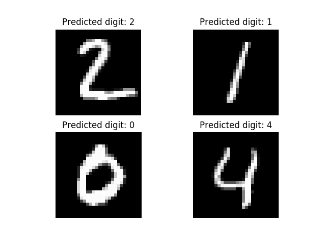

# Handwritten Digit Recognition (MNIST + Ballot Reader)

This directory contains:

1. A TensorFlow CNN trainer for MNIST (`tf_cnn.py`)
2. A ballot-focused inference pipeline (`ballot_reader/`) that detects vote boxes and reads handwritten digits

The trained model file used by the ballot pipeline is `tf-cnn-model.keras` (or `tf-cnn-model.h5`).

## Project layout

- `tf_cnn.py`: trains a CNN on MNIST and saves model artifacts
- `tf-cnn-model.keras`: default model loaded by the CLI
- `ballot_reader/cli.py`: end-to-end ballot image processing CLI
- `ballot_reader/tests/test_regression_ballot.py`: regression test entry point
- `assets/images/`: sample single-digit images
- `result.png`: sample output visualization

## Requirements

- Python 3
- pip

Install dependencies:

```bash
pip install -r requirements.txt
```

## Train the MNIST model

From this folder:

```bash
python tf_cnn.py
```

This trains the CNN and writes:

- `tf-cnn-model.keras` (recommended format)
- `tf-cnn-model.h5` (legacy format)

## Run ballot digit extraction

Process one image:

```bash
python -m ballot_reader.cli --input path/to/ballot.jpg --out debug_output
```

Process a folder of images:

```bash
python -m ballot_reader.cli --input path/to/ballots --out debug_output
```

Optional flags:

- `--model path/to/model.keras`: use a custom model file
- `--expected 15`: expected candidate row count (improves row/box assignment)

## Output

For each ballot, the CLI creates a subfolder under `--out` and writes:

- `results.json`: row-to-digit mapping
- `results.csv`: same mapping in CSV format
- debug images/metadata per row and processing stage

`NULL` means the row was treated as blank or unreadable.

## Run regression test

```bash
python -m unittest ballot_reader.tests.test_regression_ballot
```

Note: the regression test expects a loadable model path from `BallotConfig` and uses `test_ballot.png` (it creates a dummy image if missing).

## MNIST dataset note

MNIST contains 60,000 training images and 10,000 test images of handwritten digits, each normalized to 28x28 grayscale.

## Example result


